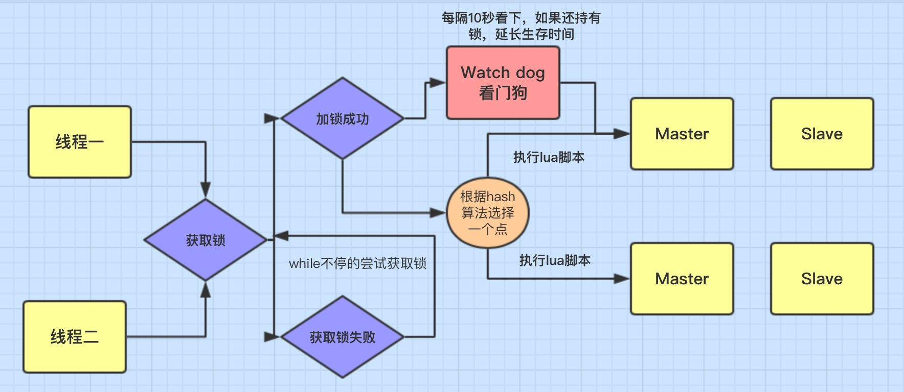

# Redis相关

这是关于数据结构的内容...

## Redis线程模型

介绍线程模型的内容...

## Redis分布式锁

为了更好的理解分布式锁的原理，我这边自己画张图通过这张图来分析：



### 1、加锁机制
线程去获取锁，获取成功: 执行 lua脚本，保存数据到 redis数据库。

线程去获取锁，获取失败: 一直通过 while循环尝试获取锁，获取成功后，执行 lua脚本，保存数据到 redis数据库。

### 2、Watch dog自动延期机制
在一个分布式环境下，假如一个线程获得锁后，突然服务器宕机了，那么这个时候在一定时间后这个锁会自动释放，你也可以设置锁的有效时间(不设置默认30秒），这样的目的主要是防止死锁的发生。

但在实际开发中会有下面一种情况:

```java
//设置锁1秒过期
redissonLock.lock("redisson", 1);
/**
* 业务逻辑需要咨询2秒
*/
redissonLock.release("redisson");

/**
* 线程1 进来获得锁后，线程一切正常并没有宕机，但它的业务逻辑需要执行2秒，这就会有个问题，
* 在 线程1 执行1秒后,这个锁就自动过期了，那么这个时候 线程2 进来了。那么就存在 线程1和线程2 
* 同时在这段业务逻辑里执行代码，这当然是不合理的。而且如果是这种情况，那么在解锁时系统会抛异常，
* 因为解锁和加锁已经不是同一线程了，具体后面代码演示。
*/
```
所以这个时候看门狗就出现了，它的作用就是 线程1 业务还没有执行完，时间就过了，线程1 还想持有锁的话，就会启动一个 watch dog后台线程，不断的延长锁 key的生存时间。

::: tip
注意：正常这个看门狗线程是不启动的，还有就是这个看门狗启动后对整体性能也会有一定影响，所以**不建议开启看门狗**。
:::

### 3、Redis luna脚本

::: warning
todo: to be continue...
:::


## Redis主从复制原理

### 1、全量复制


### 2、断点续传


