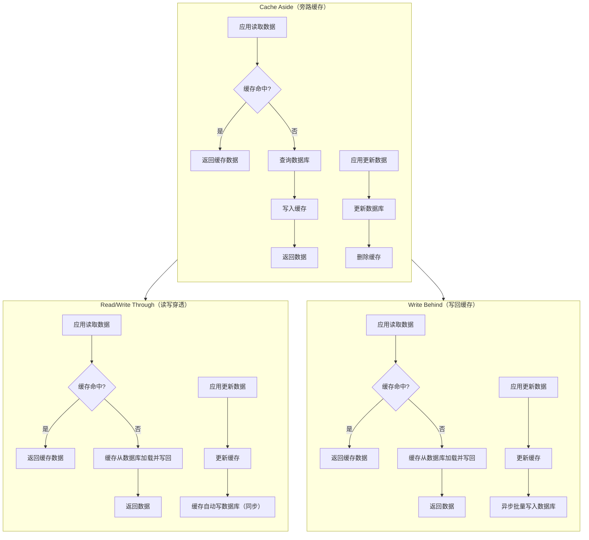
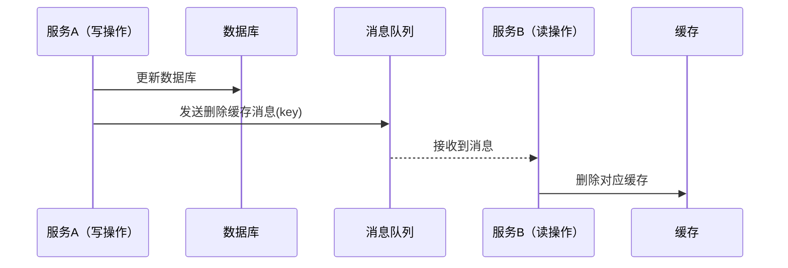
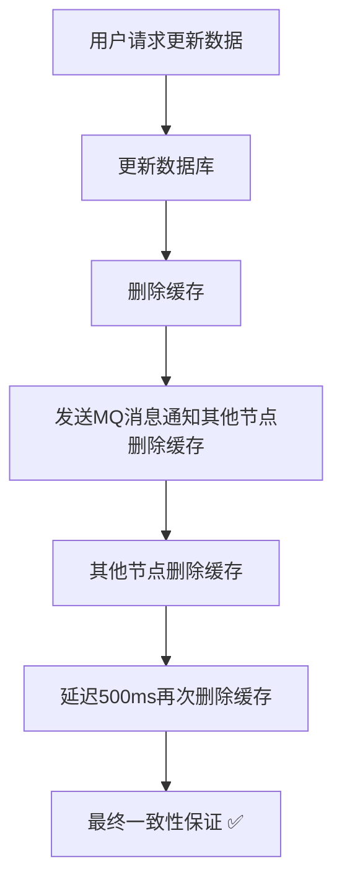

# 缓存一致性

参考文章：

- [https://mp.weixin.qq.com/s/idAReeR2Fqe6O6_ayq6AkA?scene=1](https://mp.weixin.qq.com/s/idAReeR2Fqe6O6_ayq6AkA?scene=1)
- [https://cloud.tencent.com/developer/article/1932934](https://cloud.tencent.com/developer/article/1932934)

## 一、经典场景对比



## 二、各方案优缺点对比

### 1、三种方案核心区别

#### 读操作时：

* **Cache Aside（旁路缓存）**

    * 由应用自己实现缓存回填逻辑；
    * 典型流程：**先查缓存，未命中则查DB并写入缓存**；
    * 读多写少的业务最适合，例如配置类数据、详情页、排行榜。

* **Read/Write Through（读写穿透）**

    * 缓存层（框架）封装了数据库的访问逻辑；
    * 应用只操作缓存，缓存自己负责数据加载和回写；
    * Spring Cache、Caffeine、Guava 等均可实现这种模式。

* **Write Behind（写回缓存）**

    * 读时同上，但写入时是**先写缓存，异步批量刷入数据库**；
    * 常用于高吞吐、低一致性场景（如日志、计数、推荐系统）。

---

#### 写操作时：

* **Cache Aside（旁路缓存）**

    * 一般流程：**先更新数据库，再删除缓存**（防止脏数据）。
    * 优点是灵活、可控；缺点是要自己实现一致性控制。
    * 延迟双删、MQ通知机制常用于此模式增强一致性。

* **Read/Write Through**

    * 写时先更新缓存，再由缓存同步写数据库；
    * 应用无需关心数据库细节，适合中小规模系统；
    * 一致性好，但写路径较长，性能略低。

* **Write Behind**

    * 写操作仅更新缓存，由异步线程批量落库；
    * 适合对“实时一致性”要求不高的业务；
    * 如果缓存宕机或写队列丢失，可能造成数据丢失。

---

### 2、各方案优缺点（详细维度）

| 对比维度       | Cache Aside（旁路缓存） | Read/Write Through（读写穿透） | Write Behind（写回缓存）   |
|------------|-------------------|--------------------------|----------------------|
| **读性能**    | 高（缓存命中快）          | 高（同样命中缓存）                | 高                    |
| **写性能**    | 中（双操作：DB+缓存）      | 中（写DB同步）                 | ✅ 高（异步写DB）           |
| **一致性**    | ✅ 强一致（可控制）        | ✅ 强一致                    | ⚠️ 弱一致（有延迟）          |
| **实现复杂度**  | ⚠️ 高（应用维护缓存逻辑）    | ✅ 中（框架负责）                | ⚠️ 高（需异步队列保障）        |
| **容错性**    | ✅ 好（应用可自定义补偿）     | 一般（受限于框架）                | 差（需防数据丢失）            |
| **开发成本**   | 高                 | 低                        | 高                    |
| **适用业务场景** | Web系统、微服务读多写少     | 配置缓存、系统参数                | 日志、计数、埋点、统计          |
| **典型实现**   | Redis + 自定义代码     | Spring Cache、Guava Cache | Kafka + Redis Buffer |
| **风险点**    | 并发更新时的脏缓存         | 框架抽象过深                   | 异步丢失、批量写延迟           |

---

### 3、补充维度说明

#### 💡 缓存与数据库的强一致性保证

* **Cache Aside**
  可通过“延迟双删 + MQ异步删除 + 分布式锁”达到最终一致。
  典型实现方式最灵活，也是互联网架构的默认首选。

* **Read/Write Through**
  由缓存层自动保证一致性（单体/小系统下可靠）；
  但在分布式部署下，缓存与DB之间可能仍有延迟。

* **Write Behind**
  为了保证可靠落库，通常会在缓存层维护

    * 异步队列（batch写入DB），
    * WAL日志（write-ahead log），
    * 宕机恢复机制。

---

### 4、补充：失效与更新策略

各模式对缓存失效的处理方式不同，也影响一致性与性能：

| 策略            | Cache Aside | Read/Write Through | Write Behind |
|---------------|-------------|--------------------|--------------|
| **TTL（过期时间）** | 可自定义，灵活     | 由框架控制              | 可选           |
| **主动刷新**      | 应用可触发       | 框架触发               | 不常用          |
| **被动淘汰**      | 支持（LRU/LFU） | 支持                 | 支持           |
| **缓存重建来源**    | DB          | DB                 | 缓存内部或DB      |

---

### 5、总结一句话（强化记忆）

| 模式                     | 核心特征      | 一句话记忆         |
|------------------------|-----------|---------------|
| **Cache Aside**        | 应用控制缓存逻辑  | “查不到我再查DB”    |
| **Read/Write Through** | 缓存代理数据库操作 | “你只找我，我帮你查DB” |
| **Write Behind**       | 缓存异步写回数据库 | “我先记着，之后再写DB” |

---

### 6、优缺点对比 小结

> * 互联网系统 90% 使用 **Cache Aside（旁路缓存）**。
> * 如果你使用 Spring Cache / Guava / Caffeine，这些其实是 **Read/Write Through** 的典型实现。
> * Write Behind 适合统计、日志、埋点等“可延迟一致性”的场景。

## 三、Cache Aside 模式下的一致性问题与优化策略

### 1、写操作的经典顺序问题

在 **Cache Aside（旁路缓存）** 模式中，最核心的问题是：
**更新数据库与缓存之间的顺序如何安排**，否则容易导致缓存与数据库数据不一致。

常见的三种写入顺序如下：

| 顺序                 | 操作流程                | 问题                  |
|--------------------|---------------------|---------------------|
| ① 先更新数据库 → 再更新缓存   | DB成功后立刻写缓存          | 若两次操作非原子，缓存可能被旧数据覆盖 |
| ② 先更新缓存 → 再更新数据库   | DB失败时缓存脏数据          | 容易出现数据不一致           |
| ✅ ③ 先更新数据库 → 再删除缓存 | 最推荐方案，更新时不写缓存，而是删缓存 | 可确保下次读取时缓存重建        |

因此，**推荐的标准做法**是：

```text
写数据：
1️⃣ 更新数据库
2️⃣ 删除缓存
```

下次读请求时，再由 Cache Aside 逻辑自动从数据库加载数据写入缓存。

---

### 2、延迟双删策略（解决并发问题）

在高并发场景中，仍可能出现以下时序问题:

```text
线程A更新数据库
线程B读取旧缓存
线程A删除缓存
```

线程B 可能刚好在缓存删除之前读取到了旧缓存，从而导致短暂的数据不一致。

解决办法是：**延迟双删策略（Double Deletion Delay）**

```java
public void updateData(String key, Object newValue) {
    // 1. 更新数据库
    updateDatabase(newValue);

    // 2. 删除缓存
    redis.delete(key);

    // 3. 延迟再删一次（保证旧缓存被删除）
    executor.schedule(() -> redis.delete(key), 500, TimeUnit.MILLISECONDS);
}
```

> 延迟时间（如500ms）应略大于一次数据库更新 + 缓存重建的耗时。

---

### 3、异步删除方案（消息队列通知）

在分布式环境下，可以通过消息队列确保缓存删除的可靠性：



这种方式可以：

* 确保缓存删除动作一定会执行；
* 支持多实例同步删除；
* 保证最终一致性。

---

### 4、订阅通知机制（Redis Keyspace Notifications）

Redis 自带订阅机制，也能辅助实现缓存一致性：

开启 Redis 通知功能：

```bash
notify-keyspace-events Ex
```

应用中订阅事件：

```java
private void addListener() {
    redisMessageListenerContainer.addMessageListener(
            new KeyExpirationListener(),
            new PatternTopic("__keyevent@0__:expired")
    );
}
```

可监听 key 过期、删除事件，用于触发业务刷新或日志记录。

---

### 5、布隆过滤器防击穿 + 锁防并发重建

在高并发场景下，读写并发时容易造成：

* **缓存穿透**：访问不存在的数据；
* **缓存击穿**：热点key失效瞬间，大量请求打DB；
* **缓存雪崩**：大量key同时过期。

防护手段：

| 问题类型 | 解决方案                           |
|------|--------------------------------|
| 缓存穿透 | 使用布隆过滤器（BloomFilter）预先判断key合法性 |
| 缓存击穿 | 使用分布式锁（如Redisson）防止并发重建        |
| 缓存雪崩 | 随机化过期时间，分散缓存失效点                |

---

### 6、完整示例流程（综合方案）



---

### 7 Cache Aside 模式小结

| 策略        | 优点       | 缺点      | 适用场景      |
|-----------|----------|---------|-----------|
| 先更新DB再删缓存 | 简单可靠     | 存在短暂不一致 | 大多数场景     |
| 延迟双删      | 减少并发读旧数据 | 实现稍复杂   | 高并发读多写少   |
| 消息队列异步删   | 多实例一致    | 引入MQ依赖  | 分布式系统     |
| Redis通知   | 无需MQ     | 功能有限    | 小型系统或辅助通知 |


