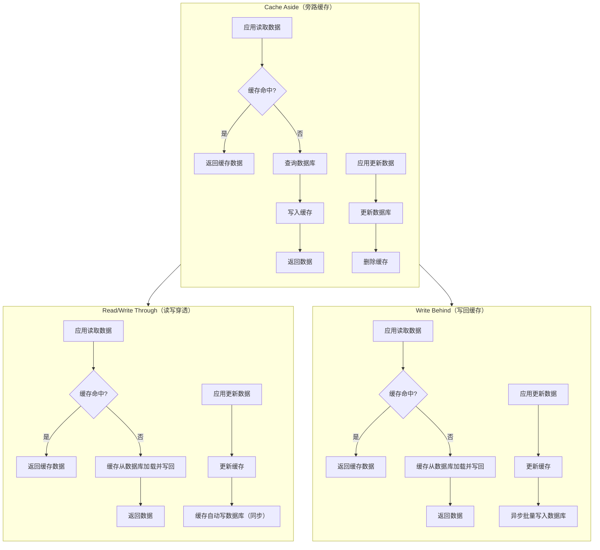

# 缓存一致性

参考文章：
- [https://mp.weixin.qq.com/s/idAReeR2Fqe6O6_ayq6AkA?scene=1](https://mp.weixin.qq.com/s/idAReeR2Fqe6O6_ayq6AkA?scene=1)
- [https://cloud.tencent.com/developer/article/1932934](https://cloud.tencent.com/developer/article/1932934)

## 一、经典场景对比

## 二、各方案优缺点对比

### 1、三种方案核心区别

#### 读操作时：

- Cache Aside 方式，是应用自己实现缓存回写
- Read/Write Through 与 Write Behind 模式，是缓存组件实现回写（如：Spring Cache、guava、Caffeine等）

#### 写操作时：

- Cache Aside 方式，是先更新数据库，再删除缓存
- Read/Write Through 与 Write Behind 模式，是先更新缓存，再更新数据库：
  - Read/Write Through 是缓存自动写入数据库（单条写）
  - Write Behind 是缓存自动写入数据库（批量写）

### 2、todo other difference
