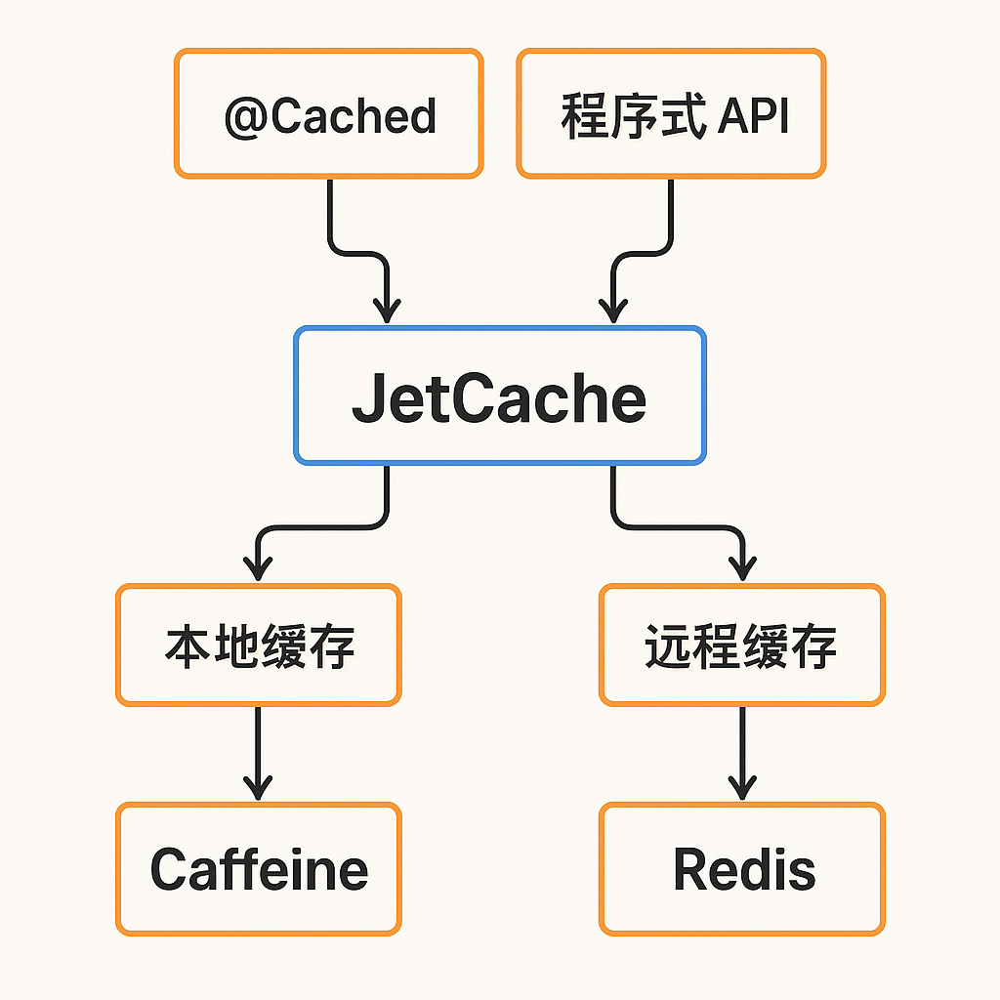

# JetCache

JetCache 是阿里巴巴开源的 Java 缓存框架，核心价值是**统一管理本地缓存（Caffeine）和分布式缓存（Redis）**，支持注解驱动和编程式两种使用方式。

GitHub：[https://github.com/alibaba/jetcache](https://github.com/alibaba/jetcache)

---

## 一、解决的问题

| 痛点 | JetCache 方案 |
|------|--------------|
| 缓存开发代码重复 | `@Cached` 注解自动缓存方法返回值 |
| 本地/远程缓存各自维护 | 统一 API，`CacheType.BOTH` 自动两级 |
| 缓存一致性难控制 | `@CacheUpdate` / `@CacheInvalidate` 注解 |
| Key/序列化管理混乱 | 统一配置，自动生成 key |
| 热点数据过期问题 | `@CacheRefresh` 异步刷新 |

---

## 二、主要能力

| 功能 | 描述 |
|------|------|
| `@Cached` | 缓存方法返回值（类似 `@Cacheable`）|
| `@CacheUpdate` | 更新缓存（类似 `@CachePut`）|
| `@CacheInvalidate` | 删除缓存（类似 `@CacheEvict`）|
| `@CacheRefresh` | 定时异步刷新缓存 |
| `CacheType.LOCAL` | 仅本地缓存 |
| `CacheType.REMOTE` | 仅远程缓存（Redis）|
| `CacheType.BOTH` | 两级缓存，自动同步 |
| 编程式 API | `Cache<K, V>` 灵活操作 |

---

## 三、快速上手

### 引入依赖

```xml
<dependency>
    <groupId>com.alicp.jetcache</groupId>
    <artifactId>jetcache-starter-redis-lettuce</artifactId>
    <version>2.7.5</version>
</dependency>
```

### 配置

```yaml
jetcache:
  statIntervalMinutes: 15        # 统计间隔（分钟）
  areaInCacheName: false
  local:
    default:
      type: caffeine
      limit: 1000                # 最大条数
      keyConvertor: fastjson2    # key 转换器
      expireAfterWriteInMillis: 100000
  remote:
    default:
      type: redis.lettuce
      keyConvertor: fastjson2
      valueEncoder: java
      valueDecoder: java
      poolConfig:
        minIdle: 5
        maxIdle: 20
        maxTotal: 50
      uri: redis://127.0.0.1:6379
```

### 启用注解

```java
@SpringBootApplication
@EnableMethodCache(basePackages = "com.example")   // 开启方法缓存
@EnableCreateCacheAnnotation                        // 开启 @CreateCache
public class Application {}
```

---

## 四、注解使用

```java
// 基本缓存（两级，过期时间100秒）
@Cached(name = "userCache:", key = "#id", expire = 100, cacheType = CacheType.BOTH)
public User getUser(Long id) {
    return userDao.findById(id);
}

// 更新缓存
@CacheUpdate(name = "userCache:", key = "#user.id", value = "#user")
public void updateUser(User user) {
    userDao.update(user);
}

// 删除缓存
@CacheInvalidate(name = "userCache:", key = "#id")
public void deleteUser(Long id) {
    userDao.deleteById(id);
}

// 自动刷新（每60秒异步刷新，stopRefreshAfterLastAccess=超过120秒未访问停止刷新）
@Cached(name = "hotData:", expire = 3600, cacheType = CacheType.BOTH)
@CacheRefresh(refresh = 60, stopRefreshAfterLastAccess = 120, timeUnit = TimeUnit.SECONDS)
public List<Product> getHotProducts() {
    return productDao.getHotList();
}
```

---

## 五、编程式 API

```java
@CreateCache(name = "orderCache:", expire = 200, cacheType = CacheType.BOTH)
private Cache<Long, Order> orderCache;

// 读写
Order order = orderCache.get(orderId);
orderCache.put(orderId, order);
orderCache.remove(orderId);

// 带加载函数
Order order = orderCache.computeIfAbsent(orderId, k -> orderDao.findById(k));
```

---

## 六、JetCache vs Spring Cache

| | JetCache | Spring Cache |
|--|---------|-------------|
| 两级缓存 | ✅ 原生支持 | ❌ 需手动实现 |
| 自动刷新 | ✅ `@CacheRefresh` | ❌ |
| key 表达式 | SpEL / `#param` | SpEL |
| 统计监控 | ✅ 内置 | ❌ |
| 多缓存区域 | ✅ | ✅ |
| 社区活跃度 | 阿里出品，稳定 | Spring 官方 |

**选型建议：** 已有两级缓存需求、需要自动刷新、或需要统计监控时选 JetCache；简单场景用 Spring Cache 即可。

---

## 七、系统架构



JetCache = 注解缓存 + 多级缓存 + 分布式缓存统一管理，让开发者专注业务逻辑而非缓存细节。
