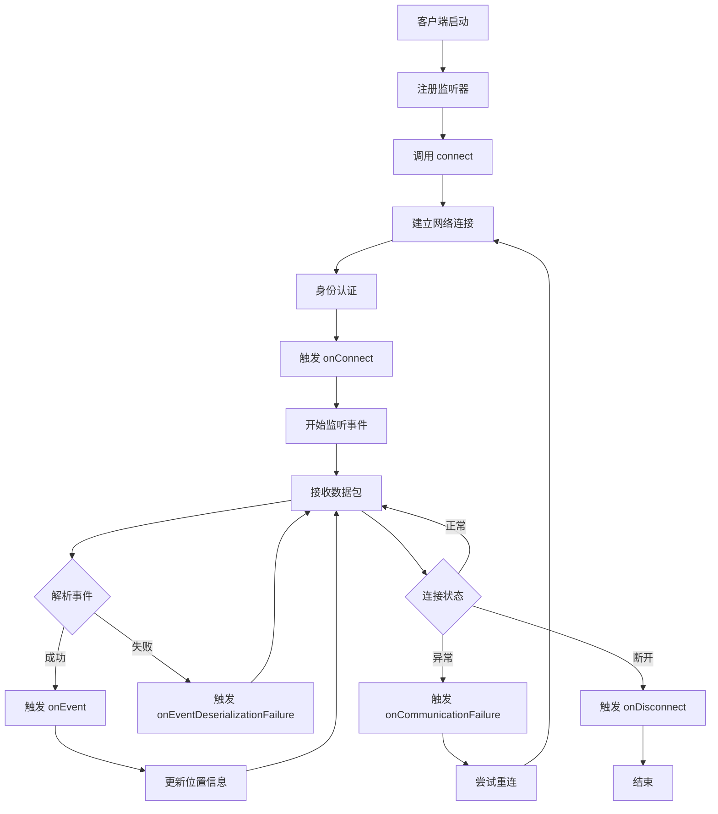
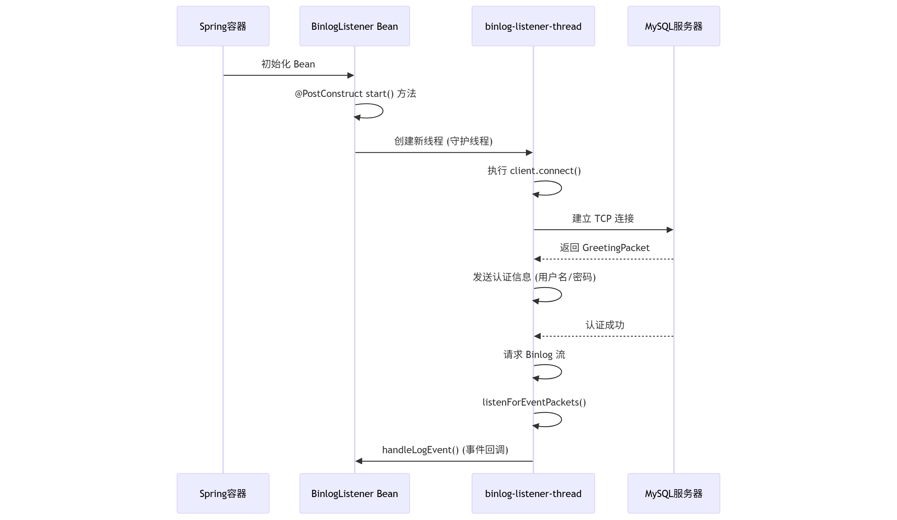

# Mysql-binlog-connect-java

- Github: [https://github.com/shyiko/mysql-binlog-connector-java](https://github.com/shyiko/mysql-binlog-connector-java)

## 一、核心类：BinaryLogClient

BinaryLogClient 是一个功能完整的 MySQL 二进制日志客户端，主要特点包括：

### 1、核心功能

- 实时数据同步：监听 MySQL binlog 事件，获取数据库变更
- 多数据库支持：支持 MySQL 和 MariaDB
- GTID 支持：完整的全局事务标识符支持
- SSL 安全连接：多种 SSL 模式支持
- 自动重连：内置保活和重连机制

### 2、架构设计

- 事件驱动：基于监听器模式处理事件
- 线程安全：使用 CopyOnWriteArrayList 和锁机制
- 资源管理：完善的连接和线程生命周期管理
- 错误处理：全面的异常处理和恢复机制

### 3、使用场景

- 数据同步和复制
- 实时数据变更监控
- 数据备份和恢复
- 数据分析和审计
- 这个客户端库为 Java 应用程序提供了与 MySQL 二进制日志交互的完整解决方案，是构建数据同步、实时监控等系统的重要基础组件。

## 二、核心方法 connect

```java
public void connect() throws IOException, IllegalStateException {
    // 1. 获取连接锁，防止重复连接
    if (!connectLock.tryLock()) {
        throw new IllegalStateException("BinaryLogClient is already connected");
    }

    try {
        // 2. 建立网络连接
        channel = openChannel();

        // 3. 接收服务器问候包
        GreetingPacket greetingPacket = receiveGreeting();

        // 4. 解析数据库版本
        resolveDatabaseVersion(greetingPacket);

        // 5. 尝试升级到 SSL（如果需要）
        tryUpgradeToSSL(greetingPacket);

        // 6. 进行身份认证
        new Authenticator(greetingPacket, channel, schema, username, password).authenticate();

        // 7. 设置连接参数
        setupConnection();

        // 8. 请求二进制日志流
        requestBinaryLogStream();

        // 9. 开始监听事件
        listenForEventPackets();
    } finally {
        connectLock.unlock();
    }
}
```

## 三、listenForEventPackets 方法

`listenForEventPackets()` 是 `BinaryLogClient` 的核心方法，负责持续监听 MySQL 服务器发送的二进制日志事件包。

### 1. 方法概述

```java
private void listenForEventPackets() throws IOException {
    ByteArrayInputStream inputStream = channel.getInputStream();
    boolean completeShutdown = false;
    // ... 事件监听循环
}
```

**作用**：
- 持续读取 MySQL 服务器发送的 binlog 事件包
- 解析事件并通知注册的监听器
- 处理各种异常情况
- 维护连接状态和位置信息

### 2. 主要处理流程

#### 2.1 初始化阶段
```java
ByteArrayInputStream inputStream = channel.getInputStream();
boolean completeShutdown = false;
```
- 获取网络通道的输入流
- 初始化关闭标志

#### 2.2 主循环 - 持续监听事件
```java
while (inputStream.peek() != -1) {
    // 处理每个数据包
}
```

**循环条件**：`inputStream.peek() != -1` 表示还有数据可读

#### 2.3 数据包解析

**步骤1：读取数据包头部**
```java
int packetLength = inputStream.readInteger(3);  // 读取3字节的数据包长度
inputStream.skip(1);                            // 跳过1字节的序列号
int marker = inputStream.read();                // 读取1字节的标记
```

**MySQL 协议数据包格式**：
```
+------------------+------------------+------------------+------------------+
|     Length       |     Sequence     |     Payload      |     Marker       |
|   (3 bytes)      |    (1 byte)      |   (variable)     |    (1 byte)      |
+------------------+------------------+------------------+------------------+
```

**步骤2：处理特殊标记**

**错误包处理 (0xFF)**：
```java
if (marker == 0xFF) {
    ErrorPacket errorPacket = new ErrorPacket(inputStream.read(packetLength - 1));
    throw new ServerException(errorPacket.getErrorMessage(), errorPacket.getErrorCode(),
        errorPacket.getSqlState());
}
```

**EOF 包处理 (0xFE)**：
```java
if (marker == 0xFE && !blocking) {
    completeShutdown = true;
    break;
}
```
- 在非阻塞模式下，EOF 包表示服务器主动断开连接

#### 2.4 事件反序列化

```java
Event event;
try {
    event = eventDeserializer.nextEvent(packetLength == MAX_PACKET_LENGTH ?
        new ByteArrayInputStream(readPacketSplitInChunks(inputStream, packetLength - 1)) :
        inputStream);
    if (event == null) {
        throw new EOFException();
    }
} catch (Exception e) {
    // 处理反序列化异常
}
```

**关键逻辑**：
- 如果数据包长度等于 `MAX_PACKET_LENGTH` (16777215)，说明数据被分片
- 需要调用 `readPacketSplitInChunks()` 重新组装数据
- 否则直接使用原始输入流

#### 2.5 大包分片处理

```java
private byte[] readPacketSplitInChunks(ByteArrayInputStream inputStream, int packetLength) throws IOException {
    byte[] result = inputStream.read(packetLength);
    int chunkLength;
    do {
        chunkLength = inputStream.readInteger(3);  // 读取下一个分片长度
        inputStream.skip(1);                       // 跳过序列号
        result = Arrays.copyOf(result, result.length + chunkLength);  // 扩展结果数组
        inputStream.fill(result, result.length - chunkLength, chunkLength);  // 填充数据
    } while (chunkLength == Packet.MAX_LENGTH);  // 如果长度等于最大值，说明还有更多分片
    return result;
}
```

**分片重组逻辑**：
- MySQL 协议限制单个数据包最大 16MB
- 超过限制的数据会被分成多个包
- 需要重新组装成完整的数据

#### 2.6 事件处理

```java
if (isConnected()) {
    eventLastSeen = System.currentTimeMillis();           // 更新最后事件时间
    updateGtidSet(event);                                 // 更新 GTID 信息
    notifyEventListeners(event);                          // 通知事件监听器
    updateClientBinlogFilenameAndPosition(event);         // 更新位置信息
}
```

**处理步骤**：
1. **时间戳更新**：用于保活机制检测
2. **GTID 更新**：维护全局事务标识符状态
3. **事件通知**：调用所有注册的事件监听器
4. **位置更新**：更新当前 binlog 文件名和位置

### 3. 异常处理机制

#### 3.1 反序列化异常
```java
} catch (Exception e) {
    Throwable cause = e instanceof EventDataDeserializationException ? e.getCause() : e;
    if (cause instanceof EOFException || cause instanceof SocketException) {
        throw e;  // 重新抛出网络相关异常
    }
    if (isConnected()) {
        for (LifecycleListener lifecycleListener : lifecycleListeners) {
            lifecycleListener.onEventDeserializationFailure(this, e);
        }
    }
    continue;  // 跳过当前事件，继续处理下一个
}
```

**处理策略**：
- 网络异常：重新抛出，终止连接
- 数据异常：通知监听器，跳过当前事件
- 继续处理：不中断整个监听循环

#### 3.2 通信异常
```java
} catch (Exception e) {
    if (isConnected()) {
        for (LifecycleListener lifecycleListener : lifecycleListeners) {
            lifecycleListener.onCommunicationFailure(this, e);
        }
    }
}
```

### 4. 资源清理

```java
} finally {
    if (isConnected()) {
        if (completeShutdown) {
            // 完全关闭（包括保活线程）
            disconnect();
        } else {
            // 只关闭网络连接
            disconnectChannel();  
        }
    }
}
```

**清理策略**：
- **完全关闭**：服务器主动断开时，关闭所有资源
- **部分关闭**：网络异常时，只关闭网络连接，保活线程会尝试重连

### 5. 方法特点

#### 5.1 阻塞性
- 方法会阻塞直到连接断开
- 在 `connect()` 方法中调用，是连接过程的核心

#### 5.2 容错性
- 单个事件解析失败不会终止整个监听
- 网络异常会触发重连机制

#### 5.3 实时性
- 持续监听，实时处理事件
- 立即通知监听器，无缓冲延迟

### 6. 使用场景

```java
// 在 connect() 方法中的调用
public void connect() throws IOException, IllegalStateException {
    // ... 连接建立逻辑
    try {
        // ... 其他初始化
        listenForEventPackets();  // 开始监听事件（阻塞）
    } finally {
        connectLock.unlock();
    }
}
```

### 7. 总结

`listenForEventPackets()` 方法实现了：

1. **持续监听**：循环读取 MySQL 事件包
2. **协议解析**：处理 MySQL 二进制日志协议
3. **事件分发**：将解析的事件通知给监听器
4. **状态维护**：更新 GTID、位置等状态信息
5. **异常处理**：优雅处理各种异常情况
6. **资源管理**：确保连接和资源正确清理

这是整个 `BinaryLogClient` 的核心，负责将 MySQL 的二进制日志事件转换为 Java 对象并分发给应用程序。

## 四、完整流程图



## 五、使用方法

### 1、简化处理方案

```java
package com.clarence.mdm.model.binlog;

import com.fasterxml.jackson.databind.ObjectMapper;
import com.github.shyiko.mysql.binlog.BinaryLogClient;
import com.github.shyiko.mysql.binlog.event.*;
import jakarta.annotation.PostConstruct;
import jakarta.annotation.PreDestroy;
import jakarta.annotation.Resource;
import lombok.extern.slf4j.Slf4j;
import org.springframework.beans.factory.annotation.Value;
import org.springframework.context.annotation.Configuration;
import org.springframework.jdbc.core.JdbcTemplate;

import java.io.Serializable;
import java.util.LinkedHashMap;
import java.util.List;
import java.util.Map;
import java.util.concurrent.ConcurrentHashMap;

@Slf4j
@Configuration
public class BinlogListenerConfig {

    @Value("${binlog.host}")
    private String host;

    @Value("${binlog.port}")
    private int port;

    @Value("${binlog.username}")
    private String username;

    @Value("${binlog.password}")
    private String password;

    @Value("${binlog.server-id}")
    private long serverId;

    private BinaryLogClient client;

    @Resource
    private JdbcTemplate jdbcTemplate;

    private final ObjectMapper objectMapper = new ObjectMapper();

    private final Map<Long, TableMapEventData> tableMap = new ConcurrentHashMap<>();
    private final Map<String, List<String>> tableColumnsCache = new ConcurrentHashMap<>();

    @PostConstruct
    public void start() {
        client = new BinaryLogClient(host, port, username, password);
        client.setServerId(serverId);

        // 注册事件监听器
        client.registerEventListener(this::handleLogEvent);

        log.info("启动 Binlog 监听 ({}:{}) ...", host, port);

        // 使用独立线程避免阻塞 Spring 启动
        Thread thread = new Thread(() -> {
            try {
                client.connect();
            } catch (Exception e) {
                log.error("Binlog 连接失败", e);
            }
        }, "binlog-listener-thread");
        thread.setDaemon(true);
        thread.start();
    }

    /**
     * 处理日志事件
     *
     * @param event 事件
     */
    private void handleLogEvent(Event event) {
        EventData data = event.getData();
        if (data == null) return;

        // 先处理 TableMapEventData，缓存 tableId -> TableMapEventData
        if (data instanceof TableMapEventData tableMapEvent) {
            tableMap.put(tableMapEvent.getTableId(), tableMapEvent);
            log.debug("缓存 TableMapEventData -> tableId={} db={} table={}",
                    tableMapEvent.getTableId(),
                    tableMapEvent.getDatabase(),
                    tableMapEvent.getTable());
            return; // 直接返回，不需要其他处理
        }

        try {
            if (data instanceof WriteRowsEventData writeData) {
                TableMapEventData tableInfo = tableMap.get(writeData.getTableId());
                // tableMap 还没收到 TableMapEventData
                if (tableInfo == null) return;
                for (Serializable[] row : writeData.getRows()) {
                    Map<String, Object> rowMap = rowToMap(tableInfo, row);
                    String json = objectMapper.writeValueAsString(Map.of(
                            "eventType", "INSERT",
                            "database", tableInfo.getDatabase(),
                            "table", tableInfo.getTable(),
                            "row", rowMap
                    ));
                    log.info("Binlog write listener, publish JSON -> {}", json);
                }
            } else if (data instanceof UpdateRowsEventData updateData) {
                TableMapEventData tableInfo = tableMap.get(updateData.getTableId());
                if (tableInfo == null) return;
                for (var row : updateData.getRows()) {
                    Map<String, Object> beforeMap = rowToMap(tableInfo, row.getKey());
                    Map<String, Object> afterMap = rowToMap(tableInfo, row.getValue());
                    String json = objectMapper.writeValueAsString(Map.of(
                            "eventType", "UPDATE",
                            "database", tableInfo.getDatabase(),
                            "table", tableInfo.getTable(),
                            "before", beforeMap,
                            "after", afterMap
                    ));
                    log.info("Binlog update listener, publish JSON -> {}", json);
                }
            } else if (data instanceof DeleteRowsEventData deleteData) {
                TableMapEventData tableInfo = tableMap.get(deleteData.getTableId());
                if (tableInfo == null) return;
                for (Serializable[] row : deleteData.getRows()) {
                    Map<String, Object> rowMap = rowToMap(tableInfo, row);
                    String json = objectMapper.writeValueAsString(Map.of(
                            "eventType", "DELETE",
                            "database", tableInfo.getDatabase(),
                            "table", tableInfo.getTable(),
                            "row", rowMap
                    ));
                    log.info("Binlog delete listener, publish JSON -> {}", json);
                }
            } else if (data instanceof QueryEventData queryData) {
                String sql = queryData.getSql().trim();
                if (sql.equalsIgnoreCase("BEGIN") || sql.equalsIgnoreCase("COMMIT")) {
                    log.info("[TRANSACTION] -> {}", sql);
                } else {
                    // 去掉客户端注释
                    String pureSql = sql.replaceAll("^/\\*.*?\\*/\\s*", "");
                    String upper = pureSql.toUpperCase();
                    if (upper.startsWith("CREATE") || upper.startsWith("ALTER") || upper.startsWith("DROP")) {
                        log.info("[DDL] Listener-> {}", pureSql);
                    } else {
                        log.info("[OTHER QUERY] Listener-> {}", pureSql);
                    }
                }
            }
        } catch (Exception e) {
            log.error("处理 binlog 事件出错", e);
        }
    }

    private Map<String, Object> rowToMap(TableMapEventData tableInfo, Serializable[] row) {
        Map<String, Object> map = new LinkedHashMap<>();
        if (tableInfo == null || row == null) return map;

        // 获取列名
        List<String> columns = tableColumnsCache.computeIfAbsent(
                tableInfo.getDatabase() + "." + tableInfo.getTable(),
                k -> queryColumnNames(tableInfo.getDatabase(), tableInfo.getTable())
        );

        for (int i = 0; i < row.length; i++) {
            String colName = i < columns.size() ? columns.get(i) : "col" + i;
            map.put(colName, row[i]);
        }
        return map;
    }

    /**
     * 查询表的列名列表（按 ordinal_position 排序）
     * @param dbName 数据库名
     * @param tableName 表名
     * @return 列名列表
     */
    public List<String> queryColumnNames(String dbName, String tableName) {
        String sql = "SELECT COLUMN_NAME FROM information_schema.columns " +
                "WHERE table_schema = ? AND table_name = ? " +
                "ORDER BY ORDINAL_POSITION";
        return jdbcTemplate.queryForList(sql, String.class, dbName, tableName);
    }

    @PreDestroy
    public void stop() throws Exception {
        if (client != null) {
            client.disconnect();
            log.info("Binlog 监听已停止");
        }
    }
}

```

### 2、代码时序图



## 未完待续...