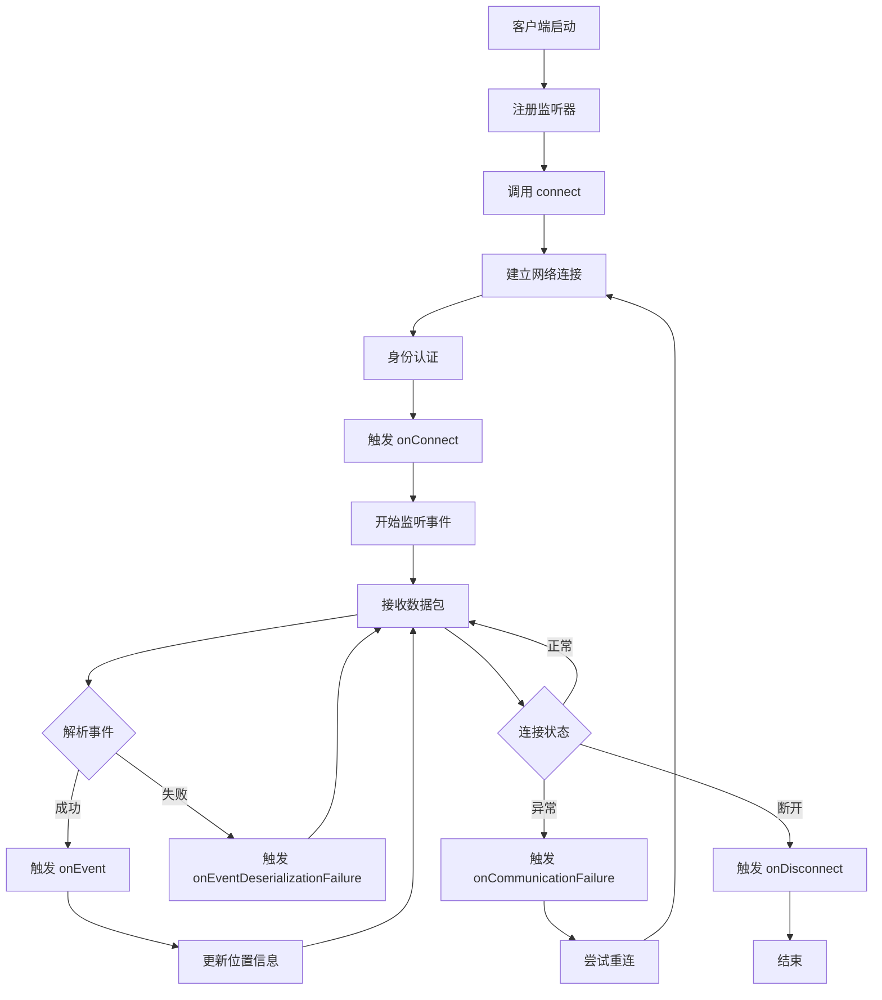

# Mysql-binlog-connect-java 源码

## 一、核心类：BinaryLogClient

BinaryLogClient 是一个功能完整的 MySQL 二进制日志客户端，主要特点包括：

### 1、核心功能

- 实时数据同步：监听 MySQL binlog 事件，获取数据库变更
- 多数据库支持：支持 MySQL 和 MariaDB
- GTID 支持：完整的全局事务标识符支持
- SSL 安全连接：多种 SSL 模式支持
- 自动重连：内置保活和重连机制

### 2、架构设计

- 事件驱动：基于监听器模式处理事件
- 线程安全：使用 CopyOnWriteArrayList 和锁机制
- 资源管理：完善的连接和线程生命周期管理
- 错误处理：全面的异常处理和恢复机制

### 3、使用场景

- 数据同步和复制
- 实时数据变更监控
- 数据备份和恢复
- 数据分析和审计
- 这个客户端库为 Java 应用程序提供了与 MySQL 二进制日志交互的完整解决方案，是构建数据同步、实时监控等系统的重要基础组件。

## 二、核心方法 connect

```java
public void connect() throws IOException, IllegalStateException {
    // 1. 获取连接锁，防止重复连接
    if (!connectLock.tryLock()) {
        throw new IllegalStateException("BinaryLogClient is already connected");
    }

    try {
        // 2. 建立网络连接
        channel = openChannel();

        // 3. 接收服务器问候包
        GreetingPacket greetingPacket = receiveGreeting();

        // 4. 解析数据库版本
        resolveDatabaseVersion(greetingPacket);

        // 5. 尝试升级到 SSL（如果需要）
        tryUpgradeToSSL(greetingPacket);

        // 6. 进行身份认证
        new Authenticator(greetingPacket, channel, schema, username, password).authenticate();

        // 7. 设置连接参数
        setupConnection();

        // 8. 请求二进制日志流
        requestBinaryLogStream();

        // 9. 开始监听事件
        listenForEventPackets();
    } finally {
        connectLock.unlock();
    }
}
```

## 三、完整流程图


## 未完待续...