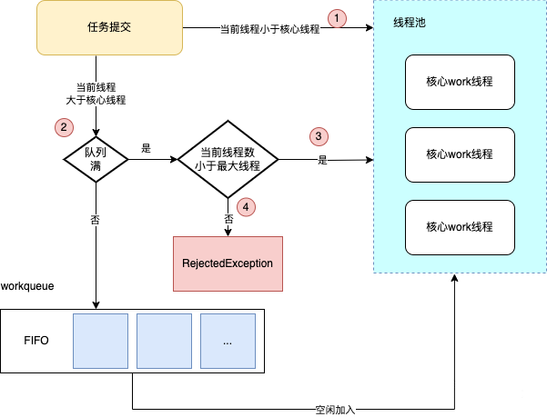

# ThreadPool

关于Executor的介绍，在 <RouteLink to="/java/1_base#八、线程池基础-executors">Java基础-线程池基础（Executors）</RouteLink> 
已经讲述过，此处只着重介绍 ThreadPoolExecutor相关的处理方案，以下为参考文章：

>[程序员老猫-背会了常见的几个线程池用法，结果被问翻](https://mp.weixin.qq.com/s/xWbSPHJG_TztJpM4Pv9knw)

> [程序员追风-面试官：线程池灵魂8连问，你挡的住吗？](https://mp.weixin.qq.com/s/7ub5RhxfuklzYsa84tGAzQ)

## 一、什么是线程池？

说到 **线程池**，其实我们要先聊到 **池化技术**。

池化技术：我们将资源或者任务放入池子，使用时从池中取，用完之后交给池子管理。通过优化资源分配的效率，达到性能的调优。

**池化技术优点**：

- 资源被重复使用，减少了资源在分配销毁过程中的系统的调度消耗。

::: tip
比如，在IO密集型的服务器上，并发处理过程中的子线程或子进程的 创建和销毁过程，带来的系统开销将是难以接受的。
所以在业务实现上，通常把一些资源预先分配好，如线程池，数据库连接池，Redis连接池， HTTP连接池等，来减少系统消耗，提升系统性能。
:::

- 池化技术分配资源，会集中分配，这样有效避免了碎片化的问题。

- 可以对资源的整体使用做限制，相关资源预分配且只在预分配后生成，后续不再动态添加，从而限制了整个系统对资源的使用上限。

所以我们说线程池是 **提升线程可重复利用率、可控性的池化技术的一种。**

## 二、线程池的底层原理

### 1、类继承视图


### 2、构造函数说明

```java
public ThreadPoolExecutor(int corePoolSize,
                              int maximumPoolSize,
                              long keepAliveTime,
                              TimeUnit unit,
                              BlockingQueue<Runnable> workQueue,
                              ThreadFactory threadFactory,
                              RejectedExecutionHandler handler) {
    if (corePoolSize < 0 ||
        maximumPoolSize <= 0 ||
        maximumPoolSize < corePoolSize ||
        keepAliveTime < 0)
        throw new IllegalArgumentException();
    if (workQueue == null || threadFactory == null || handler == null)
        throw new NullPointerException();
    this.acc = System.getSecurityManager() == null ?
            null :
            AccessController.getContext();
    this.corePoolSize = corePoolSize;
    this.maximumPoolSize = maximumPoolSize;
    this.workQueue = workQueue;
    this.keepAliveTime = unit.toNanos(keepAliveTime);
    this.threadFactory = threadFactory;
    this.handler = handler;
}
```

下面我们来解释一下几个参数的含义：

- **corePoolSize**：核心线程数。

- **maximumPoolSize**：最大线程数。

- **keepAliveTime**：线程池中线程的最大闲置生命周期。

- **unit**：针对keepAliveTime的时间单位。

- **workQueue**：阻塞队列。

- **threadFactory**：创建线程的线程工厂。

- **handler**：拒绝策略。

### 3、工作流程概述



::: tip 流程解析

1. 当发起任务时候，会计算线程池中存在的线程数量与核心线程数量（corePoolSize）进行比较，如果小于，则在线程池中创建线程，否则，进行下一步判断。

2. 如果不满足条件1，则会将任务添加到阻塞队列中。等待线程池中的线程空闲下来后，获取队列中的任务进行执行。

3. 但是条件2中如果阻塞队列满了之后，此时又会重新获取当前线程的数量和最大线程数(maximumPoolSize)进行比较，如果发现小于最大线程数，那么继续添加到线程池中即可。

4.如果都不满足上述条件，那么此时会放到拒绝策略中。

:::

### 4、execute核心流程

```java
/**
 * Executes the given task sometime in the future.  The task
 * may execute in a new thread or in an existing pooled thread.
 *
 * If the task cannot be submitted for execution, either because this
 * executor has been shutdown or because its capacity has been reached,
 * the task is handled by the current {@code RejectedExecutionHandler}.
 *
 * @param command the task to execute
 * @throws RejectedExecutionException at discretion of
 *         {@code RejectedExecutionHandler}, if the task
 *         cannot be accepted for execution
 * @throws NullPointerException if {@code command} is null
 */
public void execute(Runnable command) {
    if (command == null)
        throw new NullPointerException();
    /*
     * Proceed in 3 steps:
     *
     * 1. If fewer than corePoolSize threads are running, try to
     * start a new thread with the given command as its first
     * task.  The call to addWorker atomically checks runState and
     * workerCount, and so prevents false alarms that would add
     * threads when it shouldn't, by returning false.
     *
     * 2. If a task can be successfully queued, then we still need
     * to double-check whether we should have added a thread
     * (because existing ones died since last checking) or that
     * the pool shut down since entry into this method. So we
     * recheck state and if necessary roll back the enqueuing if
     * stopped, or start a new thread if there are none.
     *
     * 3. If we cannot queue task, then we try to add a new
     * thread.  If it fails, we know we are shut down or saturated
     * and so reject the task.
     */
    int c = ctl.get();
    if (workerCountOf(c) < corePoolSize) {
        if (addWorker(command, true))
            return;
        c = ctl.get();
    }
    if (isRunning(c) && workQueue.offer(command)) {
        int recheck = ctl.get();
        if (! isRunning(recheck) && remove(command))
            reject(command);
        else if (workerCountOf(recheck) == 0)
            addWorker(null, false);
    }
    else if (!addWorker(command, false))
        reject(command);
}
```

### 5、BlockingQueue

### 6、拒绝策略说明

### 7、线程池最优参数


## 三、动态线程池

此处查看详情：[dynamictp](https://dynamictp.cn/)
