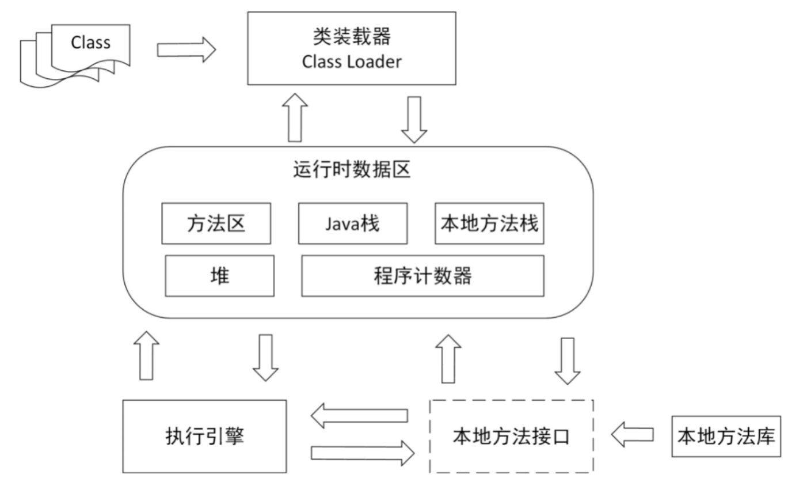
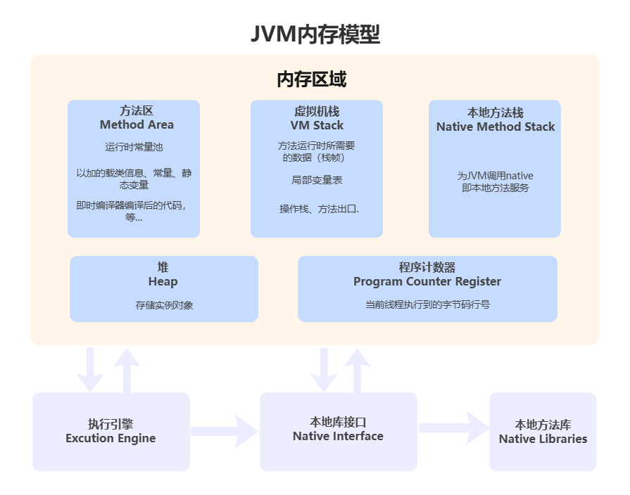
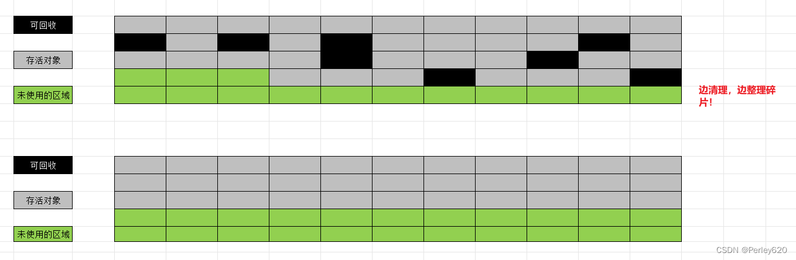

# Java总结-JVM
## JVM是如何运行的？

VM（Java Virtual Machine，Java虚拟机）是 Java 程序的运行环境，它负责将 Java 字节码翻译成机器代码并执行。也就是说 Java 代码之所以能够运行，主要是依靠 JVM 来实现的。

JVM 整体的大概执行流程是这样的：

1. 程序在执行之前先要把 Java 代码转换成字节码（class 文件），JVM 首先需要把字节码通过一定的方式**类加载器（ClassLoader）** 把文件加载到内存中**运行时数据区（Runtime Data Area）**；
2. 但字节码文件是 JVM 的一套指令集规范，并不能直接交个底层操作系统去执行，因此需要特定的命令解析器，也就是 JVM 的执行引擎（Execution Engine）会**将字节码翻译成底层系统指令再交由 CPU 去执行**；
3. 在执行的过程中，也需要调用其他语言的接口，如通过**调用本地库接口（Native Interface）** 来实现整个程序的运行，如下图所示：

所以，整体来看， JVM 主要通过分为以下 4 个部分，来执行 Java 程序的，它们分别是：
- 类加载器（ClassLoader）
- 运行时数据区（Runtime Data Area）
- 执行引擎（Execution Engine）
- 本地库接口（Native Interface）

## 说说JVM的内存模型？

- 程序计数器：负责追踪线程执行的字节码指令。
- JVM栈：存储方法的局部变量、操作数栈和方法调用的栈帧，线程私有。
- 本地方法栈：支持本地方法的调用，通常与JVM栈功能类似。
- 堆：存储对象实例，是JVM内存中最大的区域，由垃圾回收器管理。
- 方法区/元空间：存储类的信息、常量池、静态变量等，JDK 8后由元空间代替永久代。

## 垃圾回收算法

### 1、标记-清除

::: tip 优点
可以看到，标记清除算法解决了引用计数算法中的循环引用的问题，没有从root节点引用的对象都会被回收。
:::

::: warning 缺点

- 效率较低，标记和清除两个动作都需要遍历所有的对象，并且在GC时，需要停止应用程序，对于交互性要求比较高的应用而言这个体验是非常差的。
- 通过标记清除算法清理出来的内存，碎片化较为严重，因为被回收的对象可能存在于内存的各个角落，所以清理出来的内存是不连贯的。
:::

### 2、标记-复制

::: warning 缺点
但是这种算法：浪费内存
  :::
### 3、标记-压缩

::: warning 缺点
但是这种算法：效率太低
:::

三种算法都有问题，JVM采用三种的综合运用，产生了各种各样的GC垃圾回收器！

## 垃圾回收器

