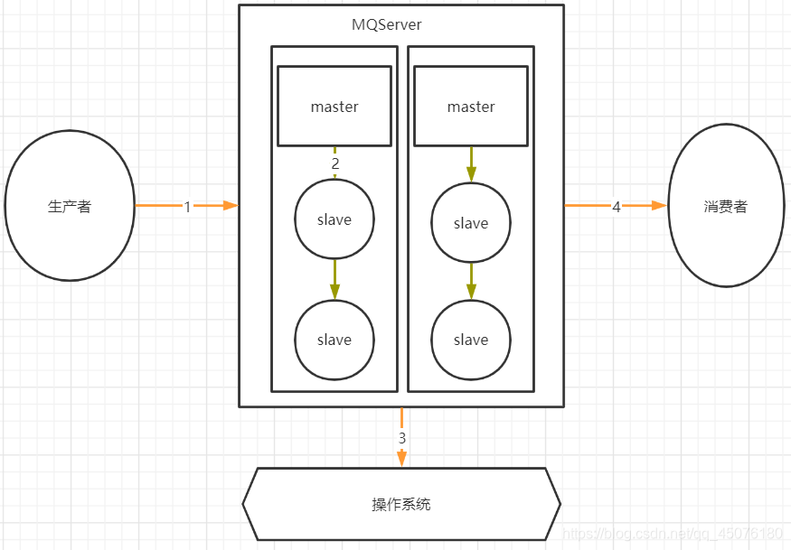

# Java总结-消息队列
## 一、消息队列的使用场景
以下介绍消息队列在实际应用常用的使用场景。异步处理、应用解耦、流量削锋三个个场景：

### 1、异步处理
例如：用户注册后，需要发注册邮件和注册短信

### 2、应用解耦

例如：用户下单后，订单系统需要通知库存系统。

### 3、流量削锋

例如：**秒杀活动**，流量暴增，应用容易挂掉。一般需要在应用前端加入消息队列。

## 二、消息队列的工作流程？


【1】发送端 MQ-Product （消息生产者）将消息发送给 MQ-server；


【2】MQ-server 将消息落地，持久化到数据库等；


【3】MQ-server 回 ACK 给 MQ-Producer；


【4】MQ-server 将消息发送给消息接收端 MQ-Consumer （消息消费者）；


【5】MQ-Consumer 消费接收到消息后发送 ACK 给 MQ-server；


【6】MQ-server 将落地消息删除；

## 三、MQ如何保证消息不丢失？



1、生产者消息发送回调处理：

即为异步发送，处理callback的重试机制；

2、主从复制消息丢失处理
- 如 RocketMQ的消息的强同步复制（同步复制模式）或者异步复制
- 如 Kafka 默认提供 ISR（in-sync replica）机制，确保所有副本都同步更新数据

3、消息刷盘完后，响应producer：

4、消息消费完成后，响应消息 mq-server：

总结：但是针对于不紧要的数据，提高系统速度，可以接受消息丢失问题

## 四、Mq消息的幂等性（重复消费）如何保证？

开篇：所有Mq产品都没有主动提供消费者重复消费的问题，最好的方式是自己做一个全局的唯一标识

1、全局唯一标识ID：
```java
String messageId = message.getId();
if (idempotentRepository.exists(messageId)) {
    // 消息已处理，忽略
    return;
}
// 处理消息
processMessage(message);
// 标记消息为已处理
idempotentRepository.save(messageId);
```

2、使用去重存储（如 Redis、数据库） 保存已经处理的消息标识符

```java
if (redis.setIfAbsent(messageId, "processed", 1, TimeUnit.HOURS)) {
    processMessage(message);
} else {
    // 消息重复，忽略
}
```

3、幂等处理逻辑

```java
INSERT INTO orders (order_id, user_id, amount)
VALUES ('12345', 1, 100)
ON DUPLICATE KEY UPDATE updated_at = NOW();
```
4、MQ 自带机制

一些高级消息中间件（如 RocketMQ、Kafka）提供了重复消费控制的机制。

**RocketMQ：唯一标识及其事务**

- 使用消息的 msgId 或 unique key 。
- 配合事务消息进行两阶段提交（prepare 和 confirm 阶段）。

**Kafka： 消费组结合 offset 提交**

- 通过消费者维护 offset，避免重复拉取消息。
- 手动控制 offset 提交时机，仅在成功处理消息后更新。

## 五、Mq如何保证消息顺序消费？

### 1、单队列单消费者

- 生产者：将相关联的消息发送到同一条队列中。

- 消费者：设置单个消费者依次处理消息，确保消费顺序。
:::tip
优点：
实现简单，天然保持顺序性。
:::
:::warning
缺点：
队列吞吐量有限，性能受单消费者影响。
:::
例如,RocketMQ提供了如下方案：
```java
//顺序消息发送。
MessageBuilder messageBuilder = new MessageBuilderImpl();;
Message message = messageBuilder.setTopic("topic")
        //设置消息索引键，可根据关键字精确查找某条消息。
        .setKeys("messageKey")
        //设置消息Tag，用于消费端根据指定Tag过滤消息。
        .setTag("messageTag")
        //设置顺序消息的排序分组，该分组尽量保持离散，避免热点排序分组。
        .setMessageGroup("fifoGroup001")
        //消息体。
        .setBody("messageBody".getBytes())
        .build();
try {
    //发送消息，需要关注发送结果，并捕获失败等异常
    SendReceipt sendReceipt = producer.send(message);
    System.out.println(sendReceipt.getMessageId());
} catch (ClientException e) {
    e.printStackTrace();
}
//消费顺序消息时，需要确保当前消费者分组是顺序投递模式，否则仍然按并发乱序投递。
//消费示例一：使用PushConsumer消费顺序消息，只需要在消费监听器处理即可。
MessageListener messageListener = new MessageListener() {
    @Override
    public ConsumeResult consume(MessageView messageView) {
        System.out.println(messageView);
        //根据消费结果返回状态。
        return ConsumeResult.SUCCESS;
    }
};
//消费示例二：使用SimpleConsumer消费顺序消息，主动获取消息进行消费处理并提交消费结果。
//需要注意的是，同一个MessageGroup的消息，如果前序消息没有消费完成，再次调用Receive是获取不到后续消息的。
List<MessageView> messageViewList = null;
try {
    messageViewList = simpleConsumer.receive(10, Duration.ofSeconds(30));
    messageViewList.forEach(messageView -> {
        System.out.println(messageView);
        //消费处理完成后，需要主动调用ACK提交消费结果。
        try {
            simpleConsumer.ack(messageView);
        } catch (ClientException e) {
            e.printStackTrace();
        }
    });
} catch (ClientException e) {
    //如果遇到系统流控等原因造成拉取失败，需要重新发起获取消息请求。
    e.printStackTrace();
}
```

### 2、按分区或分片管理
使用消息队列的分区机制（如 Kafka 的分区，RocketMQ 的队列）。

对某种业务键（如订单号、用户 ID 等）进行哈希计算，将同一键的消息路由到同一个分区。
消费者按分区逐条消费，保证分区内的消息顺序。

- 发送消息时路由分区： 生产者发送消息时，根据业务键计算分区：
```java
int partition = businessKey.hashCode() % numPartitions;
producer.send(new ProducerRecord<>("topic", partition, key, value));
```
分区消费处理方案： 
- 单线程，消费者为每个分区分配单独的线程，按顺序拉取和处理消息。
- 使用分布式锁，实现按顺序拉取和处理消息。
:::tip
优点：
可以并行处理不同分区，性能更高。
分区内部顺序可保证。
:::
:::warning
缺点：
跨分区的全局顺序无法保证。
分区配置复杂度增加。
:::

### 3、手动定制消息顺序

如果在RabbitMQ或者Kafka中，就需要自行设计顺序消费逻辑；

## 六、MQ如何保证消息的高效读写

todo

## 七、MQ如何保证分布式事务的最终一致性

todo

## 八、如何设计一个MQ？

todo

## 九、RocketMQ常见面试题：


以下内容待实践后调整：

> 参考资料：[RocketMQ常见面试题](https://blog.csdn.net/ctwctw/article/details/107463884)

## 十、Kafka常见面试题：

以下内容待实践后调整：

> 参考资料：[Kafka常见面试题](https://javabetter.cn/interview/kafka-40.html)

## 十一、RocketMQ与Kafka对比？

### 1、RocketMQ架构图

> 参考地址：[https://blog.csdn.net/weixin_45304503/article/details/140248110](https://blog.csdn.net/weixin_45304503/article/details/140248110)


### 2、Kafka架构图

> 参考地址：[https://blog.csdn.net/weixin_45304503/article/details/140088911](https://blog.csdn.net/weixin_45304503/article/details/140088911)


> RocketMQ与Kafka有何不同(上): [https://mp.weixin.qq.com/s/P40GLfVa7oFq0c0JgolvIQ](https://mp.weixin.qq.com/s/P40GLfVa7oFq0c0JgolvIQ)

> RocketMQ与Kafka有何不同(下): [https://mp.weixin.qq.com/s/ioIr3nTBX5AMm3r8f49Mjw](https://mp.weixin.qq.com/s/ioIr3nTBX5AMm3r8f49Mjw)
