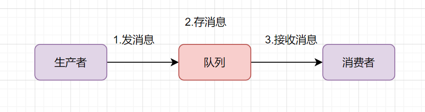
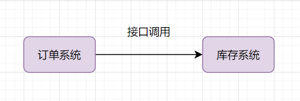
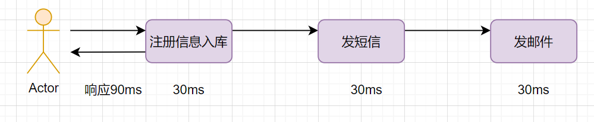

# 消息中间件

## 一、什么是消息中间件？

消息中间件（Message Middleware）是一种用于在分布式系统中传递消息的中间层软件，提供可靠的异步通信机制。它可以解耦系统之间的依赖，提高系统的可伸缩性和容错性。

你可以把消息队列理解为一个使用队列来通信的组件。它的本质，就是个转发器，包含发消息、存消息、消费消息的过程。最简单的消息队列模型如下：

我们通常说的消息队列，简称MQ（Message Queue），它其实就指消息中间件，当前业界比较流行的开源消息中间件包括：RabbitMQ、RocketMQ、Kafka。

## 二、消息中间件的核心作用

### 1、应用解耦

举个常见业务场景：下单扣库存，用户下单后，订单系统去通知库存系统扣减。传统的做法就是订单系统直接调用库存系统：

- 如果库存系统无法访问，下单就会失败，订单和库存系统存在耦合关系

- 如果业务又接入一个营销积分服务，那订单下游系统要扩充，如果未来接入越来越多的下游系统，那订单系统代码需要经常修改

如何解决这个问题呢？可以引入消息队列

- 订单系统：用户下单后，消息写入到消息队列，返回下单成功

- 库存系统：订阅下单消息，获取下单信息，进行库存扣减操作。

### 2、流量削峰

流量削峰也是消息队列的常用场景。我们做秒杀实现的时候，需要避免流量暴涨，打垮应用系统的风险。可以在应用前面加入消息队列。

假设秒杀系统每秒最多可以处理2k个请求，每秒却有5k的请求过来，可以引入消息队列，秒杀系统每秒从消息队列拉2k请求处理得了。

有些伙伴担心这样会出现**消息积压**的问题，

- 首先秒杀活动不会每时每刻都那么多请求过来，高峰期过去后，积压的请求可以慢慢处理；

- 其次，如果消息队列长度超过最大数量，可以直接抛弃用户请求或跳转到错误页面；

### 3、异步处理

我们经常会遇到这样的业务场景：用户注册成功后，给它发个短信和发个邮件。

如果注册信息入库是30ms，发短信、邮件也是30ms，三个动作**串行执行**的话，会比较耗时，响应90ms：

如果采用并行执行的方式，可以减少响应时间。注册信息入库后，同时异步发短信和邮件。如何实现异步呢？

用消息队列即可，就是说，注册信息入库成功后，写入到消息队列（这个一般比较快，如只需要3ms），然后异步读取发邮件和短信。

### 4、消息通讯

消息队列内置了高效的通信机制，可用于消息通讯。如实现点对点消息队列、聊天室等。

### 5、 远程调用

可以基于MQ，自研远程调用框架。

## 三、消息中间件消息模型

### 1、点对点（P2P）模式

消息由生产者发送到队列，消费者从队列消费，每条消息只能被一个消费者处理。

### 2、发布/订阅（Pub/Sub）模式

生产者将消息发送到主题，多个订阅者可以同时接收相同的消息。

### 3、其他模型

除了传统的点对点和发布/订阅模式，一些消息中间件还引入了以下模型以满足更复杂的业务需求：

#### （1）请求/响应（Request/Reply）模式

该模式用于服务间通信，生产者发送请求消息后，期待消费者处理完成后返回响应消息，通常通过临时队列或回调机制实现。适用于 RPC
场景，如 gRPC、MQ + 回调队列等组合。

#### （2）广播模式（Broadcast）

消息发送者将同一条消息广播给所有订阅者，无需事先建立订阅关系。所有消费者都能收到副本，常用于配置更新、通知广播等场景。例如
RocketMQ 的广播消费模式。

#### （3）延迟消息（Delay Message）

消息发送后并不会立即投递，而是等待一段时间后再被消费。适用于订单支付超时处理、定时任务等。例如 RabbitMQ 的 TTL + DLX 机制，或
RocketMQ 的延迟级别。

#### （4）顺序消息（Ordered Message）

确保同一业务标识下的消息按照发送顺序被消费。例如用户提交订单、支付、发货等流程必须严格有序。Kafka 提供了分区有序的能力，RocketMQ
支持局部顺序消费。

#### （5）事务消息（Transactional Message）

支持在发送消息的同时绑定本地事务，确保本地操作和消息投递的一致性，防止中间状态。主要用于分布式事务处理，如 RocketMQ 的事务消息机制。

## 四、消息中间件的关键特性

### 1、高可用性

通过主从架构、集群部署、数据持久化等方式保证消息的可靠性。

### 2、 消息可靠性

ACK 机制：消费者确认消息已成功处理，未确认的消息可以重新投递。

消息重试：对于失败的消息，提供重试机制或死信队列（DLQ）。

### 3、 顺序性

全局顺序：保证所有消息按照生产顺序被消费。

分区顺序：在特定分区内保证顺序，适用于 Kafka。

### 4、 可扩展性

通过分区、分片等技术提升消息队列的吞吐能力。

### 5、 一致性

最终一致性：消息中间件通常采用最终一致性策略，保证数据在一段时间后同步。

事务消息：支持分布式事务，如 RocketMQ 提供事务消息。

## 五、RabbitMQ vs RocketMQ vs Kafka

### 1、**基本信息对比**

| 特性     | RabbitMQ             | RocketMQ | Kafka    |
|--------|----------------------|----------|----------|
| **类型** | 消息代理（传统型，使用 AMQP 协议） | 分布式消息中间件 | 分布式事件流平台 |
| **协议** | AMQP, MQTT, STOMP    | 自定义协议    | 自定义协议    |

### 2、**适用场景与架构**

| 特性       | RabbitMQ                    | RocketMQ         | Kafka             |
|----------|-----------------------------|------------------|-------------------|
| **适用场景** | 高兼容性，支持多种消息模式（如发布-订阅、请求-响应） | 高吞吐量，支持可靠消息和调度功能 | 高吞吐量和可扩展性，优化事件流处理 |
| **架构**   | 集中式                         | 分布式，主从架构与代理      | 分布式，分区式，领导者-追随者模型 |

### 3、**性能与可靠性**

| 特性      | RabbitMQ          | RocketMQ        | Kafka               |
|---------|-------------------|-----------------|---------------------|
| **性能**  | 中等（适用于中等消息量场景）    | 高性能（可处理每秒数百万消息） | 非常高的性能（针对日志型事件处理优化） |
| **可靠性** | 通过消息确认和持久化机制保障可靠性 | 提供持久化和事务支持的可靠消息 | 基于分布式日志和复制的高可靠性     |

### 4、**可扩展性与延迟**

| 特性       | RabbitMQ     | RocketMQ | Kafka       |
|----------|--------------|----------|-------------|
| **可扩展性** | 有限（横向扩展较为复杂） | 高可扩展性    | 高可扩展性       |
| **延迟**   | 低到中等         | 低到中等     | 非常低（接近实时处理） |

### 5、**复杂度与消息存储**

| 特性       | RabbitMQ         | RocketMQ            | Kafka            |
|----------|------------------|---------------------|------------------|
| **复杂度**  | 简单易用             | 复杂度中等（需要理解代理、名称服务等） | 高复杂度（需要配置分区、副本等） |
| **消息保留** | 短期存活（默认消息消费后即删除） | 可配置（支持长期消息存储）       | 长期保留（为日志和流存储设计）  |

### 6、**顺序保证与事务支持**

| 特性       | RabbitMQ  | RocketMQ    | Kafka                           |
|----------|-----------|-------------|---------------------------------|
| **顺序保证** | 支持队列内消息顺序 | 支持每个消息组的顺序  | 分区内提供强顺序保证                      |
| **事务支持** | 支持        | 支持（支持分布式事务） | 有限支持（通过 Kafka Streams 实现精确一次语义） |

### 7、**社区支持与行业应用**

| 特性        | RabbitMQ       | RocketMQ               | Kafka              |
|-----------|----------------|------------------------|--------------------|
| **社区与支持** | 拥有庞大的社区和众多集成支持 | 社区增长迅速，在中国拥有良好支持       | 社区非常活跃，工具支持优良      |
| **行业应用**  | 传统企业应用         | 金融和电子商务行业，尤其在中国和亚洲广泛应用 | 各行业广泛应用，尤其是大数据管道场景 |

### 8、**依赖性与云支持**

| 特性        | RabbitMQ                  | RocketMQ      | Kafka                                         |
|-----------|---------------------------|---------------|-----------------------------------------------|
| **依赖性**   | 复杂场景需要外部数据库               | 可单独运行，或依赖外部存储 | 需要 Apache ZooKeeper（Kafka 2.8+ 可用 Kafka Raft） |
| **主流云支持** | 支持 AWS、Azure、Google Cloud | 主要支持亚洲的云服务    | 广泛支持（AWS MSK、Confluent Cloud 等）               |
