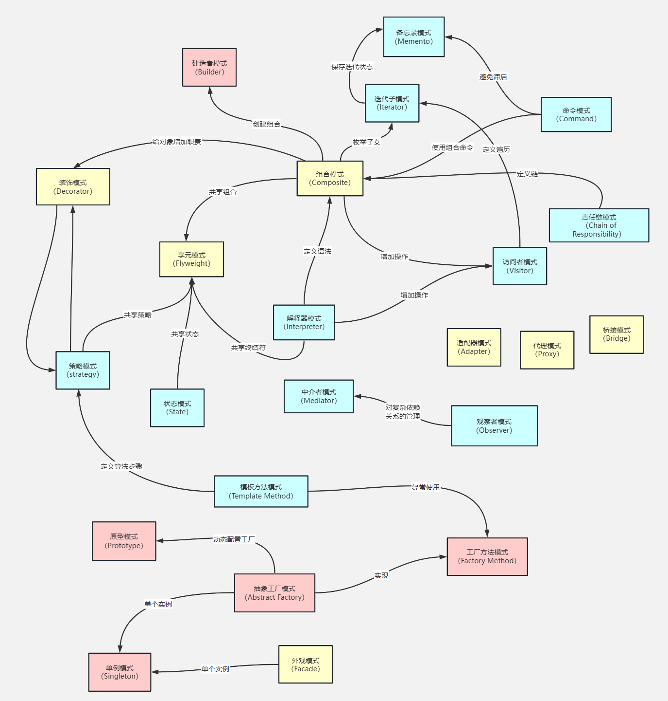

# 设计模式简介

参考链接：[菜鸟教程-设计模式](https://www.runoob.com/design-pattern/design-pattern-tutorial.html)

## 一、设计模式简介

设计模式是一套被反复使用的、为解决特定问题而总结出的面向对象设计经验。它们有助于构建更可维护、可扩展、可重用的系统结构。
设计模式并不是直接可用的代码模板，而是解决问题的最佳实践。

设计模式分为三大类：

* **创建型模式**：关注对象的创建（如单例、工厂、建造者等）
* **结构型模式**：关注类或对象的组合结构（如适配器、桥接、装饰器等）
* **行为型模式**：关注对象之间的通信与职责分配（如策略、责任链、状态等）

三大类共包含 23 种经典设计模式，如下所示：

| 类型      | 模式名称                                                                                                                                                                                                                                                                                                                                                               |
|---------|--------------------------------------------------------------------------------------------------------------------------------------------------------------------------------------------------------------------------------------------------------------------------------------------------------------------------------------------------------------------|
| **创建型** | 1. 单例模式（Singleton Pattern） 2. 工厂模式（Factory Pattern） 3.建造者模式（Builder Pattern） 4. 原型模式（Prototype Pattern） 5. 抽象工厂模式（Abstract Factory Pattern）                                                                                                                                                                                                            |
| **结构型** | 6. 适配器模式（Adapter Pattern） 7. 桥接模式（Bridge Pattern） 8. 装饰器模式（Decorator Pattern） 9. 组合模式（Composite Pattern） 10. 外观模式（Facade Pattern） 11. 享元模式（Flyweight Pattern） 12. 代理模式（Proxy Pattern）                                                                                                                                                            |
| **行为型** | 13. 策略模式（Strategy Pattern） 14. 责任链模式（Chain of Responsibility Pattern） 15. 模板方法模式（Template Method Pattern） 16. 观察者模式（Observer Pattern） 17. 命令模式（Command Pattern） 18. 状态模式（State Pattern） 19. 访问者模式（Visitor Pattern） 20. 中介者模式（Mediator Pattern） 21. 迭代器模式（Iterator Pattern） 22. 备忘录模式（Memento Pattern） 23. 解释器模式（Interpreter Pattern） |

## 二、设计模式的关系

## 三、设计模式的优点

- 提供了一种共享的设计词汇和概念，使开发人员能够更好地沟通和理解彼此的设计意图。
- 提供了经过验证的解决方案，可以提高软件的可维护性、可复用性和灵活性。
- 促进了代码的重用，避免了重复的设计和实现。
- 通过遵循设计模式，可以减少系统中的错误和问题，提高代码质量。

## 四、设计模式的六大原则

### 1、开闭原则（Open Close Principle）

开闭原则的意思是：对扩展开放，对修改关闭。在程序需要进行拓展的时候，不能去修改原有的代码，实现一个热插拔的效果。简言之，是为了使程序的
扩展性好，易于维护和升级。想要达到这样的效果，我们需要使用接口和抽象类，后面的具体设计中我们会提到这点。

### 2、里氏代换原则（Liskov Substitution Principle）

里氏代换原则是面向对象设计的基本原则之一。 里氏代换原则中说，任何基类可以出现的地方，子类一定可以出现。LSP
是继承复用的基石，只有当派生类可以替换掉基类，且软件单位的功能不受到影响时，基类才能真正被复用，而派生类也能够在基类的基础上增加新的行为。
里氏代换原则是对开闭原则的补充。实现开闭原则的关键步骤就是抽象化，而基类与子类的继承关系就是抽象化的具体实现，所以里氏代换原则是对实现
抽象化的具体步骤的规范。

### 3、依赖倒转原则（Dependence Inversion Principle）

这个原则是开闭原则的基础，具体内容：针对接口编程，依赖于抽象而不依赖于具体。

### 4、接口隔离原则（Interface Segregation Principle）

这个原则的意思是：使用多个隔离的接口，比使用单个接口要好。它还有另外一个意思是：降低类之间的耦合度。由此可见，其实设计模式就是从
大型软件架构出发、便于升级和维护的软件设计思想，它强调降低依赖，降低耦合。

### 5、迪米特法则，又称最少知道原则（Demeter Principle）

最少知道原则是指：一个实体应当尽量少地与其他实体之间发生相互作用，使得系统功能模块相对独立。

### 6、合成复用原则（Composite Reuse Principle）

合成复用原则是指：尽量使用合成/聚合的方式，而不是使用继承。
